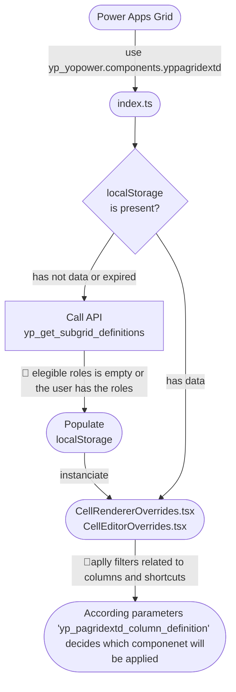

# Power Apps Grid Extensions

## About the Component

- On Power Apps Grid component, set on the property **Customizer Control** the value **yp_yopower.components.yppagridextd**.
- The name of the subgrid logical name should be unique on the environment, it allows a tailored personalization per subgrid or main grid.
- Microsoft does not define a name for main grids, then for the customizers understand this behavior set on Column Definition > Subgrid Name the table Logical Name [sample](https://github.com/user-attachments/assets/aaf0acd6-1ffd-484c-9ab5-523e7632da28)
- The customizers are associated with specific column types, a plugin will ensure that the column and parameters (json) as fulfilled correct.
- This solution uses the browser localStorage to prevent multiple requests on the Dataverse APIs, then every 24 hours the cache will expire.
- Use localStorage.removeItem("**subgrid-logical-name**") to clear the cache and see the adjusts on parameters.
- **CTRL + F5** cler the localStorage also.

## Available Customizers

| **Title**                           | **Description**                                                                                                                |
| ----------------------------------- | ------------------------------------------------------------------------------------------------------------------------------ |
| **500 Text (RichText Popover)**     | Allows rich text content to be displayed via popover                                                                           |
| **600 File (Management)**           | Visualize, download, updload and delete files                                                                                  |
| **700 Numbers & Date (Colors)**     | Determines the fill and text color of a cell based on a range of values.                                                       |
| **701 Numbers (Progress Bar)**      | Determines the fill and color of a progress bar based on a range of values.                                                    |
| **702 Numbers (Duration)**          | Allows edit duration columns as a decimal number i.e: 1,5 = 90 minutes                                                         |
| **800 Lookup (Navigate To)**        | Enables navigation buttons for forms related to the lookup.                                                                    |
| **801 Lookup (Filtered Lookup)**    | Configures a lookup field to be filtered based on the row or other subgrid columns using the `lookupObject` concept.           |
| **900 Any (Navigate To)**           | Enables navigation buttons for forms related to the row.                                                                       |
| **901 Any (Read-Only)**             | Makes read-only columns editable.                                                                                              |
| **902 Any (Related Records)**       | Works as a rollup column, support different column types to compose a fetchxml.                                                |
| **903 Any (Copilot Execute Event)** | Allows trigger an topic event on Copilot associated with the Model-Driven App.                                                 |
| **904 Any (Dependent Colors)**      | Determines the fill and text color of a cell based on an other column according range of values.                               |
| **905 Any (New Related Record)**    | Define which associated records can be created through the Power Apps Grid, respecting the relationship's mappings.            |
| **906 Any (Notes)**                 | Allows display notes related to the row, lookups or using a custom fetchxml to group them, or show the last annotation on view |
| **907 Any (Audit History)**         | Allows you to see who updated the attribute, when it was changed, and the previous values.                                     |
| **908 Any (Custom Timeline)**       | Provides a timeline view capable of displaying multiple record types, styled with icons and colors defined by parameters.      |
| **909 Any (Colors by Hex)**         | Text columns with hexadecimal values ​​can be used as parameters to define the background color of cells.                      |

## Additional Settings

| **Feature**                     | **Description**                                                                                                                                                                       |
| ------------------------------- | ------------------------------------------------------------------------------------------------------------------------------------------------------------------------------------- |
| **Conditions**                  | The customizers are applied following a priority defined by conditions related to optionsets, numbers or booleans on the grid. Is **required** the column be on the view!             |
| **Related Columns**             | It is available also define conditions using columns lookup related (N:1) with the row, just add a dot on begin '.numberofemployees'                                                  |
| **Available Conditions**        | Equals, Not Equals, In, Not In, Greater, Greater or Equals, Less, Less or Equals                                                                                                      |
| **Editable**                    | Allow a customizer enter on edit mode. (default no)                                                                                                                                   |
| **Allow Pin Column**            | Enable the column to be pinned on left or right side.                                                                                                                                 |
| **Icons**                       | Taking color blindness into account, some components support icons. Use the [Fluent UI](https://developer.microsoft.com/en-us/fluentui#/styles/web/icons) list to get the right names |
| **Short Cuts**                  | Allow change which customizer will be applied on the cell pressing CTRL or SHIFT                                                                                                      |
| **Elegible For Security Roles** | Allow define for which security roles the column definitions will be available (splited by comma)                                                                                     |

## Sample Data via Configuration Migration Tool

18 examples can be imported using Configuration Migration Tool
/sample/data.zip

### Agent

An agent was implemented to support you customize yours visualizations

## Schema

