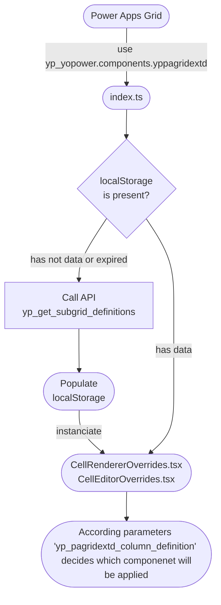

# Power Apps Grid Extensions


## About the Component
- On Power Apps Grid component, set on the property **Customizer Control** the value **yp_yopower.components.yppagridextd**.
- The name of the subgrid logical name should be unique on the environment, it allows a tailored personalization per subgrid or main grid.
- Microsoft does not define a name for main grids, then for the customizers understand this behavior set on Column Definition > Subgrid Name the table Logical Name (example)
- The customizers are associated with specific column types, a plugin will ensure that the column and parameters (json) as fulfilled correct.
- This solution uses the browser localStorage to prevent multiple requests on the Dataverse APIs, then every 5 minutes the cache will expire.
- Use localStorage.removeItem("**subgrid-logical-name**") to clear the cache and see the adjusts on parameters.

## Schema


## Available Customizers
| **Title**                        | **Description** |
|----------------------------------|---------------|
| **Any [Navigate Buttons]** | Enables navigation buttons for forms related to the row. |
| **Any [Read-Only]** | Makes read-only columns editable. |
| **Lookup [Navigate Buttons]** | Enables navigation buttons for forms related to the lookup. |
| **Lookup [Filtered Lookup]** | Configures a lookup field to be filtered based on the row or other subgrid columns using the `lookupObject` concept. |
| **Numbers & Date [Colorful Cell]** | Determines the fill and text color of a cell based on a range of values. |
| **Numbers [Progress Bar]** | Determines the fill and color of a progress bar based on a range of values. |
| **String [Related Records]** | 🎩 To-Do. |

### 1. Any [Navigate Buttons]
- ✅ Any column type
#### Parameters:
```json
{
    "modal": [
        {
            "position": 1,
            "label": "⬆️Center Modal",
            "formId": "00000000-0000-0000-0000-000000000000",
            "height": {
                "value": 80,
                "unit": "%"
            },
            "width": {
                "value": 70,
                "unit": "%"
            }
        },
        {
            "position": 2,
            "label": "↗️Right Modal",
            "formId": "00000000-0000-0000-0000-000000000000",
            "height": {
                "value": 80,
                "unit": "%"
            },
            "width": {
                "value": 70,
                "unit": "%"
            }
        }
    ],
    "sidePane": [
        {
            "label": "➡️Side Pane",
            "width": 300,
            "canClose": true,
            "paneId": "subgrid_try",
            "imageSrc": "/webresources/yp_page_try_svg.svg",
            "hideHeader": true
        }
    ]
}
```

---
### 2. Any [Read-Only]
- ✅ Any column type
⚠️ No parameters

---
### ⭐3. Any [Related Records]
- ✅ Any column type
- ⚠️ The `reference` property defines whether the row or a column is used to substitute the placeholder `#value#`.

#### Parameters:
```json
{
    "reference": "column/row",
    "column": "yp_accountid",
    "background": "#c8e3f7",
    "color": "#333333",
    "table": "phonecall",
    "fetchXmlAggregate": "<fetch version='1.0' mapping='logical' distinct='false' aggregate='true'><entity name='phonecall'><attribute name='activityid' alias='value' aggregate='count' /><link-entity name='account' from='accountid' to='regardingobjectid' link-type='inner' alias='aa'><filter type='and'><condition attribute='accountid' operator='eq' uitype='#valuetype#' value='#value#' /></filter></link-entity></entity></fetch>",
    "fetchXml": "<fetch version='1.0' output-format='xml-platform' mapping='logical' distinct='false'><entity name='phonecall'><attribute name='subject' /><attribute name='statecode' /><attribute name='prioritycode' /><attribute name='scheduledend' /><attribute name='createdby' /><attribute name='regardingobjectid' /><attribute name='activityid' /><link-entity name='account' from='accountid' to='regardingobjectid' link-type='inner' alias='aa'><filter type='and'><condition attribute='accountid' operator='eq' uitype='#valuetype#' value='#value#' /></filter></link-entity></entity></fetch>",
    "layoutXml": "<grid name='resultset' object='1' jump='createdon' select='1' icon='1' preview='1'><row name='result' id='activityid'><cell name='createdon' width='150' /><cell name='subject' width='200' /><cell name='prioritycode' width='100' /><cell name='scheduledstart' width='150' /><cell name='scheduledend' width='150' /><cell name='statuscode' width='100' /></row></grid>"
}
```

---
### 4. Lookup [Navigate Buttons]
- ✅ Lookups and Customers
- 📝 Use double click to enter edit mode

#### Parameters:
```json
{
    "modal": [
        {
            "position": 1,
            "label": "⬆️Center Modal",
            "formId": "00000000-0000-0000-0000-000000000000",
            "height": {
                "value": 80,
                "unit": "%"
            },
            "width": {
                "value": 70,
                "unit": "%"
            }
        },
        {
            "position": 2,
            "label": "↗️Right Modal",
            "formId": "00000000-0000-0000-0000-000000000000",
            "height": {
                "value": 80,
                "unit": "%"
            },
            "width": {
                "value": 70,
                "unit": "%"
            }
        }
    ],
    "sidePane": [
    ]
}
```

---
### 5. Lookup [Filtered Lookup]
- ✅ Lookups and Customers
- ⚠️ The `reference` property defines whether the row or a column is used to substitute the placeholder `#value#`.

#### Parameters:
```json
{
    "reference": "column/row",
    "column": "yp_accountid",
    "viewId": "00000000-0000-0000-0000-000000000000",
    "filter": "<filter type='and'><condition attribute='parentcustomerid' operator='eq' uitype='#valuetype#' value='#value#'/></filter>"
}
```

---
### 6. Numbers & Date [Colorful Cell]
- ✅ Decimal, Integer, Float, Currency, Duration, Date Only and Date&Time
- 📝 Use double click to enter on edit mode
- ⚠️ For Duration, Date Only and Date&Time columns utilize min and max properties as minutes

#### Parameters for Date Only, Date&Time or Duration:
```json
{
    "rules": [
        {
            "min": -10000000000,
            "max": 0,
            "background": "#E098AF",
            "color": "#1F1F1F",
            "label": "Passed date in minutes"
        },
        {
            "min": 1,
            "max": 10080,
            "background": "#FAD897",
            "color": "#1F1F1F",
            "label": "Next week in minutes"
        },
        {
            "min": 10081,
            "max": 10000000000,
            "background": "#A1D6A5",
            "color": "#1F1F1F",
            "label": "After next week in minutes"
        }
    ]
}
```

#### Parameters for Decimal, Integer, Float or Currency:
```json
{
    "rules": [
        {
            "min": -10000000000,
            "max": 0,
            "background": "#E098AF",
            "color": "#1F1F1F",
            "label": ""
        },
        {
            "min": 1,
            "max": 10000000000,
            "background": "#A1D6A5",
            "color": "#1F1F1F",
            "label": ""
        }
    ]
}
```

---
### 7. Numbers [Progress Bar]
- ✅ Integer, Decimal and Float
- 📝 Use double click to enter on edit mode.
- ⚠️ Type options: '*' (column value * 100) | '/' (column value / 100) | empty

#### Parameters Decimal (0 > 1):
```json
{
    "type": "",
    "rules": [
        {
            "min": 0,
            "max": 0.25,
            "background": "#E098AF",
            "color": "#1F1F1F",
            "label": ""
        },
        {
            "min": 0.26,
            "max": 0.50,
            "background": "#F4B394",
            "color": "#1F1F1F",
            "label": ""
        },
        {
            "min": 0.51,
            "max": 0.75,
            "background": "#FAD897",
            "color": "#1F1F1F",
            "label": ""
        },
        {
            "min": 0.76,
            "max": 1,
            "background": "#A1D6A5",
            "color": "#1F1F1F",
            "label": ""
        }
    ]
}
```

#### Parameters Integer:
```json
{
    "type": "/",
    "rules": [
        {
            "min": 1,
            "max": 25,
            "background": "#E098AF",
            "color": "#1F1F1F",
            "label": ""
        },
        {
            "min": 26,
            "max": 50,
            "background": "#F4B394",
            "color": "#1F1F1F",
            "label": ""
        },
        {
            "min": 51,
            "max": 75,
            "background": "#FAD897",
            "color": "#1F1F1F",
            "label": ""
        },
        {
            "min": 76,
            "max": 500,
            "background": "#A1D6A5",
            "color": "#1F1F1F",
            "label": ""
        }
    ]
}
```

---
