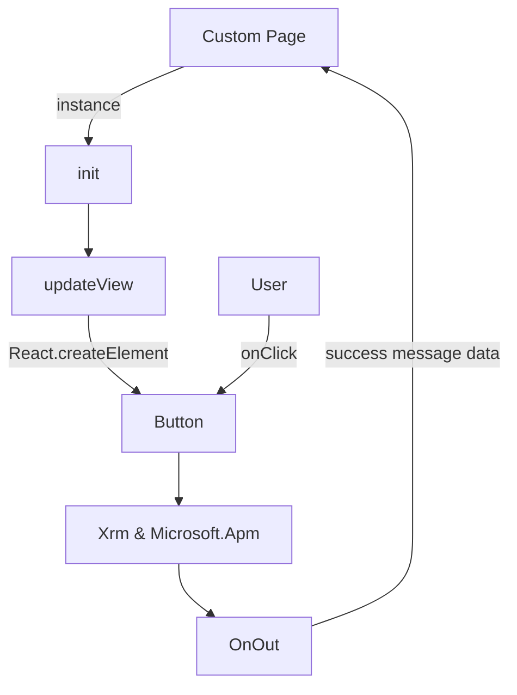

# XrmJS
Allow to Custom Pages and Canvas Apps hosted on Model-Driven App interact with Xrm and Microsoft.Apm JS libraries

## Methods
### Navigate
|Method|Inputs|
|---|---|
|Xrm.Navigation.navigateTo|pageInput,navigationOptions|
|Xrm.Navigation.openAlertDialog|alertStrings,alertOptions|
|Xrm.Navigation.openConfirmDialog|confirmStrings,confirmOptions|
|Xrm.Navigation.openErrorDialog|errorOptions|
|Xrm.Navigation.openFile|file,openFileOptions|
|Xrm.Navigation.openForm|entityFormOptions,formParameters|
|Xrm.Navigation.openUrl|url,openUrlOptions|
|Xrm.Navigation.openWebResource|webResourceName,windowOptions,data|

### Utility
|Method|Inputs|
|---|---|
|Xrm.Utility.showProgressIndicator|message|
|Xrm.Utility.closeProgressIndicator||
|Xrm.Utility.lookupObjects|lookupOptions|

### SidePanes
|Method|Inputs|
|---|---|
|Xrm.App.sidePanes.createPane|paneOptions|
|Xrm.App.sidePanes.getAllPanes||
|Xrm.App.sidePanes.getPane|paneId|
|Xrm.App.sidePanes.getSelectedPane||

### Microsoft.Apm
|Method|Inputs|
|---|---|
|Microsoft.Apm.getFocusedSession||
|Microsoft.Apm.getAllSessions||
|Microsoft.Apm.getSession|sessionId or null|
|Microsoft.Apm.createSession|parametersStr,templateName,isFocused|
|Microsoft.Apm.canCreateSession||
|Microsoft.Apm.closeSession|sessionId or null|
|Microsoft.Apm.focusSession|sessionId or null|
|Microsoft.Apm.requestFocusSession|sessionId or null|
|Microsoft.Apm.getFocusedTab|sessionId or null|
|Microsoft.Apm.getAllTabs|sessionId or null|
|Microsoft.Apm.getTab|sessionId or null, tabId or null|
|Microsoft.Apm.createTab|sessionId or null, type (entity, newentity, webresource), entityName, entityId, formId, data, webresourceName|
|Microsoft.Apm.canCreateTab|sessionId or null|
|Microsoft.Apm.closeTab|sessionId or null|
|Microsoft.Apm.focusTab|sessionId or null|
|Microsoft.Apm.refreshTab|sessionId or null|

### Schema

Trying to find a way to trigger OnSelect
> G[Select] -. OnSelect .-> C -.-> E;

### Step-by-Step
1. Add the component on Canvas App or Custom Page
2. Copy the YAML
3. Paste on the screen (root)

### Solution Checker

